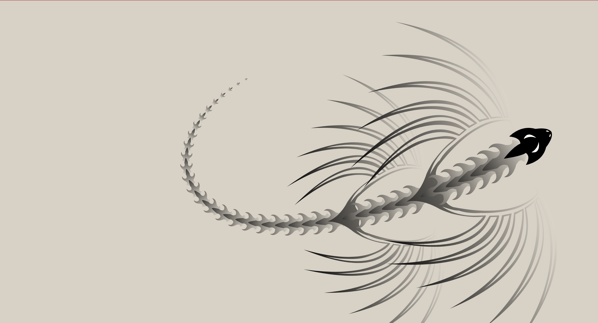

# 🐉 Interactive Dragon Animation

An interactive, animated dragon rendered using SVG, HTML, CSS, and JavaScript. This project showcases a visually captivating dragon that follows the cursor around the screen in real-time.

<!--  -->

 <!-- Add a screenshot or GIF link here -->

Click [here](dragon.gif) to see in action.

## 📑 Table of Contents

- [Introduction](#introduction)
- [Features](#features)
- [Files](#files)
- [How It Works](#how-it-works)
- [Installation and Setup](#installation-and-setup)
- [Usage](#usage)
- [Technical Details](#technical-details)
- [Customization](#customization)
- [Acknowledgments](#acknowledgments)

## 🐲 Introduction

This project demonstrates an interactive dragon that follows the user’s pointer using SVG graphics for smooth and scalable visuals. It is powered by JavaScript for real-time interactions and CSS for visual styling. The project is designed to work in a browser, where the dragon's movements create a mesmerizing animation as it tracks the mouse position.

## ✨ Features

- **Responsive Animation**: The dragon moves in response to the cursor, creating an engaging experience.
- **Smooth Graphics**: High-quality, scalable SVG ensures the dragon looks sharp on all screens.
- **Customizable**: Easily change colors, shapes, and animation effects.

## 📂 Files

The project includes three primary files:

1. **`interactive dragon.html`**: Contains the HTML structure and SVG definitions for the dragon's components.
2. **`interactive dragon.js`**: JavaScript code responsible for animating the dragon in response to mouse movements.
3. **`interactive dragon.css`**: Styles the webpage and sets the visual background and SVG dimensions.

## 🛠️ How It Works

The interactive dragon animation is achieved through a combination of SVG definitions, JavaScript DOM manipulation, and CSS styling.

1. **HTML and SVG**:
   - The SVG structure is defined in the `interactive dragon.html` file. This includes `<g>` groups with IDs for each dragon part: "Cabeza" (head), "Aletas" (fins), and "Espina" (spines).
   - These elements are referenced in JavaScript to create animated instances of each part.

2. **JavaScript**:
   - JavaScript (`interactive dragon.js`) dynamically appends SVG elements based on the mouse pointer’s location. The dragon's body follows the cursor in a fluid motion by updating its parts' `x` and `y` positions.
   - The animation is driven by `requestAnimationFrame()`, ensuring smooth, continuous updates.

3. **CSS**:
   - Basic CSS in `interactive dragon.css` provides a full-screen background, removes margins, and sets up the canvas for the dragon.

## 🖥️ Installation and Setup

### Prerequisites

- A modern web browser (e.g., Chrome, Firefox, Edge).
- A code editor (optional) if you wish to customize the files.

### Setup

1. Download the files (`interactive dragon.html`, `interactive dragon.js`, and `interactive dragon.css`).
2. Open `interactive dragon.html` in a web browser. The animation will begin automatically.

### Folder Structure
/interactive-dragon
│
├── interactive dragon.html
├── interactive dragon.js
└── interactive dragon.css

## 🚀 Usage

Open `interactive dragon.html` in your web browser, and move your mouse around. The dragon animation will follow the pointer, creating a visually engaging interaction.

## 🧑‍💻 Technical Details

### HTML: `interactive dragon.html`

The HTML file structures the webpage and contains an SVG element to render the dragon. Key sections include:

- **`<defs>`**: Defines reusable SVG elements (dragon head, fins, and spines) using `<g>` groups. These elements are referenced by ID in JavaScript for animation.
- **`<g id="screen">`**: Acts as a container for the dragon's parts. JavaScript appends instances of the SVG groups to this `<g>` element to create the dragon.

### JavaScript: `interactive dragon.js`

The JavaScript file animates the dragon by manipulating SVG elements in real-time based on mouse events. Key aspects include:

1. **Tracking Pointer Movements**:
   - Listens for pointer movements to capture `x` and `y` coordinates.
   - Uses these coordinates to dynamically reposition dragon parts.

2. **Appending SVG Elements**:
   - Dynamically creates and positions each part of the dragon using `<use>` elements.
   - Each part adjusts its position to follow the previous part, creating a smooth, snake-like movement.

3. **Animating with `requestAnimationFrame`**:
   - The `run()` function updates the dragon’s position in each frame, creating fluid movement.

### CSS: `interactive dragon.css`

The CSS file provides visual styling for the entire page. Important properties include:

- **`background`**: Sets the background color of the page and SVG, giving the dragon a sky-blue background.
- **`overflow: hidden`**: Prevents scrollbars from appearing, keeping the full animation viewable on the screen.

## 🔧 Customization

### Modifying Colors

You can adjust the background color by changing the `background` property in `interactive dragon.css`.

### Adjusting Dragon Parts

To change the dragon’s appearance, modify the path definitions in the `<defs>` section of `interactive dragon.html`. Each `<g>` group with an ID corresponds to a different part of the dragon.

### Changing Animation Speed

Adjust the `requestAnimationFrame(run);` and any delay logic in `interactive dragon.js` if you want to make the dragon’s movements faster or slower.

## 🎉 Acknowledgments

This project uses core HTML, CSS, and JavaScript technologies to achieve a simple yet engaging animation. Many thanks to the SVG and JavaScript communities for examples and resources that have contributed to this project.

---

